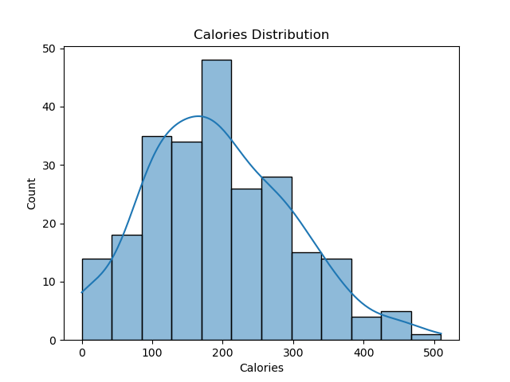
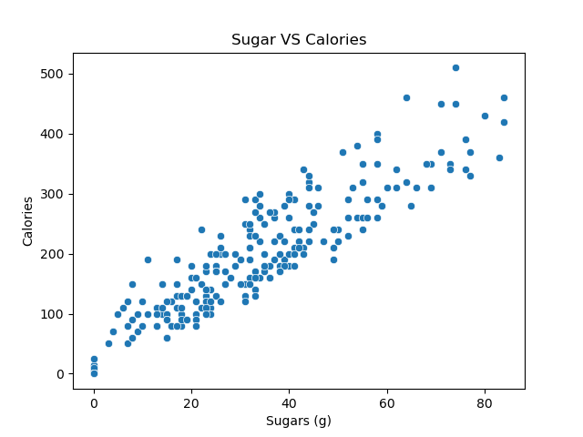
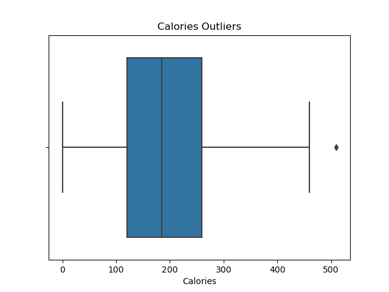
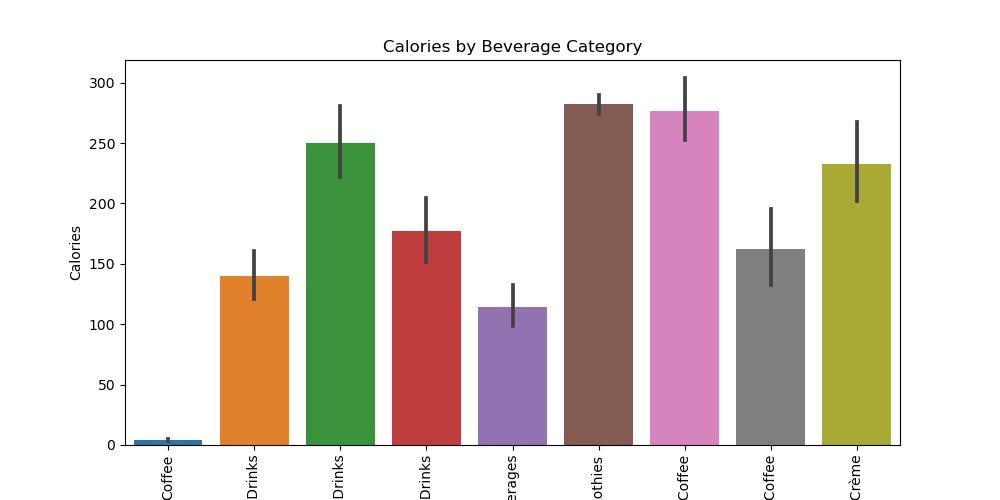
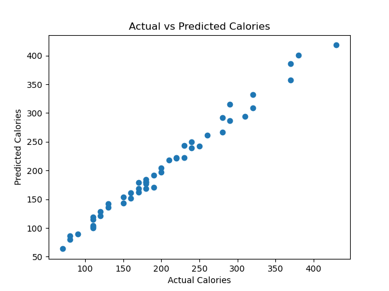
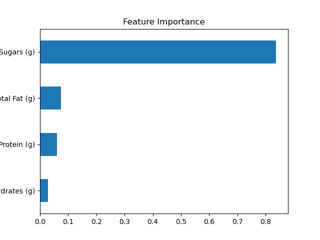

# ☕ Starbucks Calorie Prediction

This notebook explores nutritional data from Starbucks and builds machine learning models to predict calorie content.

## 📌 Overview

This project predicts the calorie content of Starbucks menu items using machine learning techniques.
It involves data cleaning, feature engineering, model building, and evaluation using regression models.

---

## 📂 Dataset

The dataset contains nutritional information of Starbucks menu items, including:

* Calories (target variable)
* Total Fat (g), Sugars (g), Protein (g)
* Other nutritional attributes

---

## ⚙️ Workflow

1. Data Cleaning and preprocessing
2. Exploratory Data Analysis (EDA)
3. Feature Engineering
4. Model Training (Linear Regression & Random Forest)
5. Model Evaluation (MSE, R² Score)

---

## 🧪 Feature Engineering

The following features were created to capture better relationships:

* **calorie_per_fat** = Calories / (Total Fat + 1)
* **sugar_to_calorie_ratio** = Sugars / (Calories + 1)
* **protein_density** = Protein / (Calories + 1)

These features help the model understand relative nutrient contributions.

---

## 🤖 Model Implementation

### Linear Regression

* Used as a baseline model
* Helps understand linear relationships between features and calories

### Random Forest Regressor

* Ensemble model for improved performance
* Captures non-linear relationships in the data

---

## 📊 Model Evaluation

The models were evaluated using:

* **Mean Squared Error (MSE)** → Measures prediction error
* **R² Score** → Measures how well the model explains variance

## 📊 Final Metrics

* Linear Regression:

  * MSE: *(89.61116748576461)*
  * R² Score: *(0.9877589287385887)*

* Random Forest:

  * R² Score: *(0.960404622173009)*

---

## 🏆 Best Model

Random Forest outperformed Linear Regression by achieving a higher R² score and lower prediction error.

This shows that calorie prediction depends on non-linear relationships, which Random Forest captures better.

## 📊 Visualizations

### Calories Distribution


### Fat vs Calories


## 📊 Visualizations

### Calories Outliers


### Calories by Beverage Category


### Actual vs Predicted 


### Feature Importance


---

## 🧠 Key Insights

* Calories are strongly influenced by fat and sugar content
* Linear Regression captures general trends but misses complex patterns
* Random Forest performs better due to its ability to model non-linear relationships
* Engineered features improve prediction performance

---

## 🚀 How to Run

```bash
pip install -r requirements.txt
jupyter notebook
```

---

## 📌 Future Improvements

* Hyperparameter tuning for Random Forest
* Try advanced models like XGBoost
* Add more feature engineering
* Deploy as a simple web app

---

## 💡 Why This Project Matters

Understanding calorie composition helps in making healthier food choices.  
This model demonstrates how nutritional data can be used to predict calorie content accurately.

## 📌 Final Conclusion

Random Forest outperformed Linear Regression by achieving a higher R² score and capturing non-linear relationships in the data more effectively.

This indicates that calorie prediction depends on complex interactions between nutritional features, which tree-based models handle better than linear models.